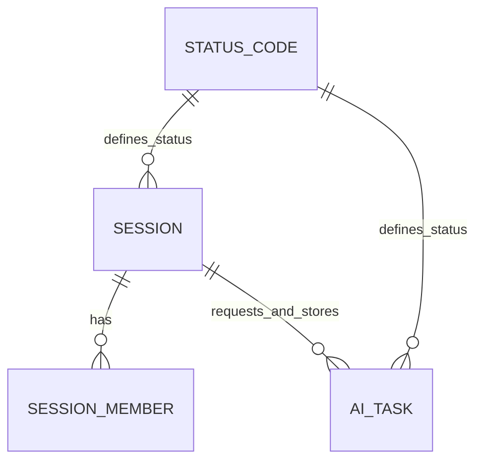

# ERD

## 문서 목적
회사도우미의 주요 데이터 구조와 관계를 정의한다.

## 초기 엔터티 후보

## 관계 설명

| 관계                             | 설명                              |
| ------------------------------ | ------------------------------- |
| SESSION - SESSION_MEMBER       | 공유 세션에 참여하는 다수의 사용자를 기록한다.       |
| SESSION - AI_TASK              | 세션 데이터를 기반으로 AI 작업을 요청하고 그 결과 및 상태를 함께 저장한다.   |
| STATUS_CODE - SESSION          | 세션의 상태(ACTIVE, ARCHIVED 등)를 공통 코드로 관리한다. |
| STATUS_CODE - AI_TASK          | AI 작업의 상태(PENDING, SUCCESS 등)를 공통 코드로 관리한다. |

## 미결정 사항

- 폴더 소유자를 계정 없이 어떻게 표시할지 여부
- 공유 세션 참여자를 별칭만 저장할지, 임시 participant_key를 함께 저장할지 여부
- 파일 본문을 PostgreSQL에 저장할지, 로컬/오브젝트 스토리지에 저장하고 DB에는 경로만 둘지 여부
- 실시간 공동 편집을 위한 이벤트/버전 테이블 필요 여부
