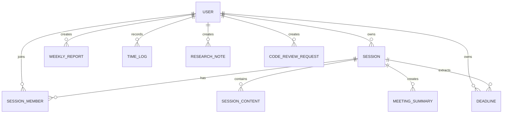

# ERD

## 문서 목적
회사도우미의 주요 데이터 구조와 관계를 정의한다.

## 초기 엔터티 후보

## 관계 설명

| 관계 | 설명 |
|---|---|
| USER - SESSION | 사용자는 개인/공유 세션을 생성한다. |
| SESSION - SESSION_MEMBER | 공유 세션은 여러 참여자를 가진다. |
| SESSION - SESSION_CONTENT | 세션은 텍스트, 이미지, 파일, AI 결과를 포함한다. |
| SESSION - MEETING_SUMMARY | 세션 기록 또는 업로드 파일에서 회의록 요약이 생성된다. |
| SESSION - DEADLINE | AI가 세션/요약에서 마감일을 추출한다. |
| USER - WEEKLY_REPORT | 사용자는 주간 보고서를 생성한다. |

## 미결정 사항

- 조직/팀 엔터티 필요 여부
- 권한/역할 모델 필요 여부
- 파일 저장소를 DB, 로컬, S3 계열 중 어디에 둘지 여부
- 실시간 공동 편집을 위한 이벤트/버전 테이블 필요 여부

