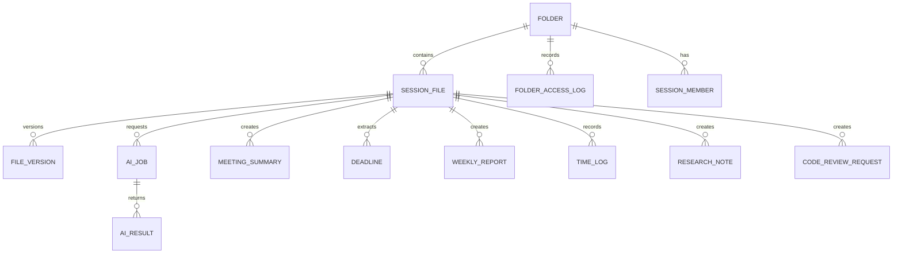

# ERD

## 문서 목적
회사도우미의 주요 데이터 구조와 관계를 정의한다.

## 초기 엔터티 후보

## 관계 설명

| 관계 | 설명 |
|---|---|
| FOLDER - SESSION_FILE | 폴더는 md/html/json 파일을 포함한다. |
| FOLDER - SESSION_MEMBER | 공유 세션 폴더는 별칭 기반 참여자를 가진다. |
| FOLDER - FOLDER_ACCESS_LOG | 잠긴 폴더 접근 시도를 기록한다. |
| SESSION_FILE - FILE_VERSION | 파일 수정 이력을 버전 단위로 저장한다. |
| SESSION_FILE - AI_JOB | 파일 또는 음성 원문 기준으로 AI 작업을 요청한다. |
| AI_JOB - AI_RESULT | AI 작업은 하나 이상의 결과를 생성한다. |
| SESSION_FILE - MEETING_SUMMARY | 세션 파일 또는 업로드 파일에서 회의록 요약이 생성된다. |
| SESSION_FILE - DEADLINE | AI가 파일/요약에서 마감일을 추출한다. |
| SESSION_FILE - WEEKLY_REPORT | 파일 기록을 기반으로 주간 보고서를 생성한다. |

## 미결정 사항

- 폴더 소유자를 계정 없이 어떻게 표시할지 여부
- 공유 세션 참여자를 별칭만 저장할지, 임시 participant_key를 함께 저장할지 여부
- 파일 본문을 PostgreSQL에 저장할지, 로컬/오브젝트 스토리지에 저장하고 DB에는 경로만 둘지 여부
- 실시간 공동 편집을 위한 이벤트/버전 테이블 필요 여부
